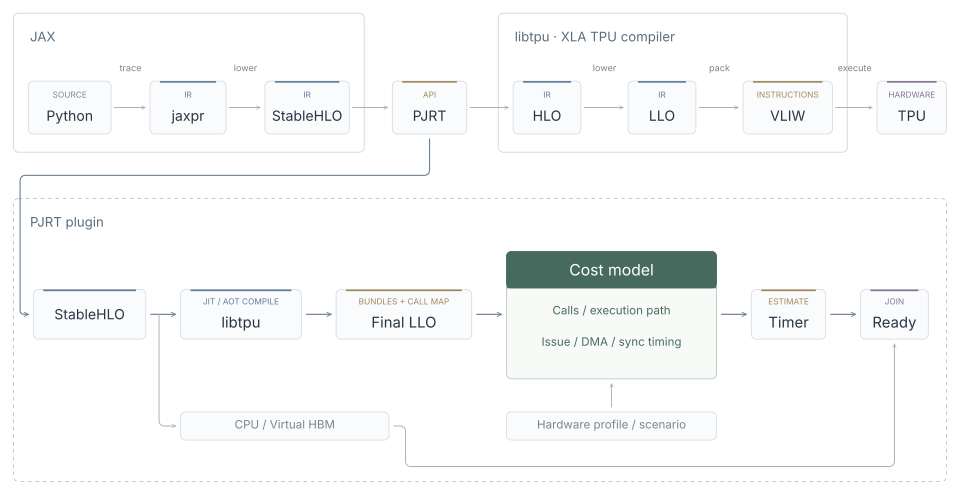

<h1> sim-pjrt</h1>

A PJRT plugin for simulating TPU workload execution and estimating performance
on CPU, without TPU hardware.

sim-pjrt uses libtpu to compile workloads (both JIT and AOT) for a target TPU
topology. It can export compilation artifacts or simulate execution with a
bundle-based timing model, Virtual HBM, and XProf traces. The `spjrt` launcher
configures the backend for existing Python programs, including supported JAX
and SGLang-Jax workloads.



## Installation

Requires **Linux x86-64**, **glibc 2.34 or newer**, and **Python 3.12 or 3.13**.
macOS, Windows, and ARM are not currently supported.

Install the development wheel in your workload's Python environment:

```sh
python -m pip install "https://github.com/primatrix/sim-pjrt/releases/download/v0.1.0.dev1/sim_pjrt-0.1.0.dev1-py3-none-manylinux_2_34_x86_64.whl"
```

See [Releases](https://github.com/primatrix/sim-pjrt/releases) for available wheels
and [dependency compatibility](docs/dependencies.md) for the runtime baseline.

## Usage

`spjrt` defaults to **TPU v7x with 8 devices**
(`tpu7x:2x2x1`). Launcher options go before the script; arguments after the script
are passed through unchanged.

### Export compilation artifacts

Compile reached JIT programs and export TPU Final LLO files and manifests:

```sh
spjrt compile --output ./llo workload.py --batch-size 4
```

This mode requires no timing profile and applies no simulated timing delays.
Artifacts are grouped by process under the output directory. The output path
must not contain whitespace or quotes. Execution still uses simulated outputs,
so data-dependent paths may differ from execution on real hardware.

### Simulate execution

```sh
spjrt run workload.py
```

The default `tpu7x` profile provides approximate v7x timing estimates.
Use `--timing-profile PATH` for your own configuration, or `--timing-profile example`
for the uncalibrated example. Override the
topology and device count as needed:

```sh
spjrt run --topology v5e:2x2 --devices 4 \
  --timing-profile ./profile.json workload.py
```

For SGLang-Jax, install it separately in the same environment:

```sh
spjrt run \
  python -m sgl_jax.launch_server \
  --model-path /path/to/model --tp-size 8 --load-format dummy
```

See the [plugin guide](docs/plugin-guide.md) for runtime configuration and
profiling, and [Python packaging](docs/python-package.md) for uv integration
and launcher options.

## Scope and limitations

- **Timing:** the current model provides **rough estimates**, not precise TPU
  execution times. Control flow, DMA, synchronization, and communication coverage
  remain partial. Estimates are not bounds on actual runtime, and host scheduling
  overhead can affect end-to-end measurements.
- **Outputs and memory:** Virtual HBM represents floating-point payloads with
  placeholders and retains CPU storage for control values. Simulated execution
  does not validate numerical results or model quality.
- **Compatibility:** some operations and execution paths are not yet supported.
  Compilation failures, missing Final LLO bundle artifacts, and unresolved timing
  semantics may prevent a workload from running.
- **Profiling:** XProf displays modeled activity. Trace compatibility does not
  imply cycle-accurate hardware simulation.

If you encounter unsupported operations, compilation failures, or missing bundle
artifacts, please [open an issue](https://github.com/primatrix/sim-pjrt/issues/new)
with a minimal reproducer, package versions, target topology, and relevant error logs.

See [bundle timing](docs/bundle-timing.md) and the
[support boundaries](docs/site/src/content/docs/reference/limitations.md) for details.

## Development

Build with Bazel 8.7.0 or Bazelisk on Linux x86-64:

```sh
bazel build //:plugin
bazel test //...
```

Bazel downloads the pinned XLA sources and toolchains. The native plugin is
written to `bazel-bin/pjrt_sim_plugin.so`. For a Docker build environment:

```sh
docker compose run --build --rm bazel build //:plugin
```

The Bazel test suite covers native unit tests and Python model tests. Workload
integration tests require their documented Python environment; see
[testing](tests/README.md).

- [Build prerequisites, Docker, and caches](docs/building.md)
- [Compilation architecture](docs/compilation-architecture.md)
- [Wheel builds and releases](docs/python-package.md)
- [Dependency maintenance](docs/dependencies.md)
- [Chinese documentation](docs/site/README.md)

## TODO

- [ ] Integrate accurate timing estimation for Final LLO bundles.
- [ ] Resolve input-dependent control flow and scalar arguments across kernel calls.
- [ ] Model DMA completion, collective synchronization, and shared-link contention.
- [ ] Extend SparseCore timing beyond calibrated operation durations to include
      startup, internal transfers, and synchronization.
- [ ] Drive execution with virtual time to reduce host scheduling effects on
      overlap and end-to-end estimates.
- [ ] Support executable serialization and persistent compilation caching.
- [ ] Improve alias-aware memory accounting and KV-cache update tracking.
- [ ] Validate estimates against real TPU traces and publish accuracy results
      across workload shapes and topologies.

See the [detailed roadmap](docs/site/src/content/docs/development/roadmap.md).

## License

[Apache-2.0](LICENSE). Third-party dependency provenance is documented in
[dependencies](docs/dependencies.md).
