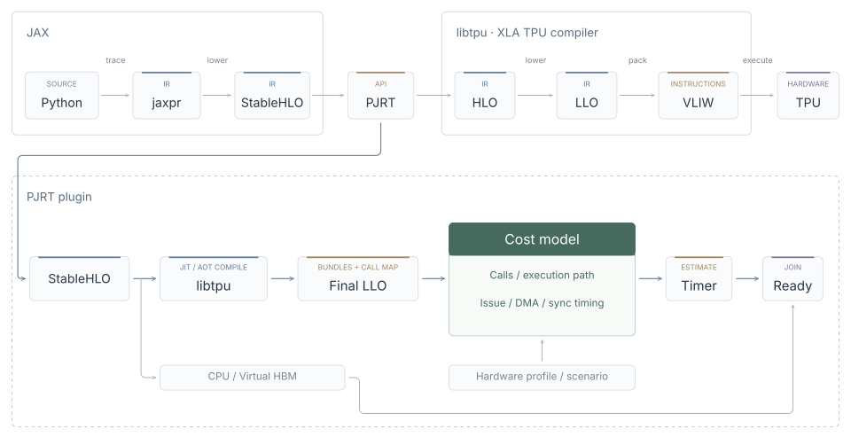

# Compilation and execution

## TPU compilation and timing

The default `llo` predictor follows the path below. Optional `replay` matches a
collected compilation identity and attaches measured timing to the MLIR module.
`CompileProgram` validates it and compiles CPU output simulation, skipping Final
LLO analysis. Real TPU profiles are collected and imported independently;
see [collection and replay](collection.md) for commands and matching limits.

Compilation can happen on demand during JAX/SGLang-Jax execution (JIT), or
explicitly ahead of execution with JAX's `.lower(...).compile()` API (AOT).
Both use the same compilation path below.

The original StableHLO and compile options go to libtpu through the
topology-based `PJRT_Compile` API. The selected topology supplies the device
generation, coordinates and core IDs; no physical TPU is required. "Offline"
in this compiler context means compilation without a physical TPU, not that
compilation must happen before the application starts. Serving workloads can
compile new programs while running.

Each compilation collects `*-final_bundles.txt`, `assembly-pre-overlay` and the
compiler's `deduplication-map`, along with the target topology, into a manifest
in `/tmp/pjrt-sim-bundles-*`.
Assembly supplies the actual per-instruction branch delays after compaction.
For v5e, the target supplies the four fixed slots omitted from assembly.
Starting at TLP,
the estimator resolves shared kernels and expands each call site. It does not
sum every dump once: one kernel may be called many times, and unused kernels
contribute no work. Missing or ambiguous callees are errors.

`python/sim_pjrt/llo/` separates parsing, control-flow analysis and timing. C++
invokes the `bundle_timing` CLI in a separate process and validates its report. The model
uses a hardware profile and optional execution scenario for issue rate, DMA,
waits and execution paths. Unresolved semantics are explicit gaps. Strict
profiles reject gaps; the example profile permits partial estimates.
Without an explicit scenario, unknown conditions take the largest local segment
cost, draining DMA at boundaries and merging shared state at the continuation.
Calibrated SparseCore maxima are added serially. This bounds covered model costs;
missing costs still prevent a hardware bound. Unknown loop bounds and exhausted
analysis budgets fail. Detailed semantics live in [bundle timing](bundle-timing.md#model).

The three counts have different meanings:

- Final LLO file count: compiler artifacts, not instruction count.
- Bundle records in those files: each shared kernel counted once.
- Call-site-expanded bundles: the static sequence supplied to the estimator.

None of these counts alone determines dynamic loop iterations or elapsed time.
See [bundle timing](bundle-timing.md) for the supported semantics.

## CPU output simulation and Virtual HBM

A separate CPU lowering preserves control flow and supplies placeholder results
for supported numerical work. CPU HLO is an implementation detail of output
simulation; timing does not use a CPU or TPU HLO cost model.

All public device buffers use Virtual HBM. There is no size threshold or switch
to a fully materialized device mode. Logical shapes, dtypes, device placement,
byte counts and readiness are preserved independently of CPU backing.

Floating tensors use scalar placeholders. Integer, boolean and single-value
floating controls retain CPU shadow storage so token IDs, indices, loop counters
and distributed available-memory queries can run. This host state still consumes memory;
Virtual HBM does not promise a constant-memory interpreter for arbitrary
integer programs.

Logical allocations share a per-device memory budget. Donation and raw aliases
share the allocation lifetime; pending work retains its allocations. Capacity
and fixed reservations are configurable, with explicit allocation failures and
logical peak statistics. Compiler scratch space and physical allocation details
remain outside this accounting. See [memory budgets](benchmark.md).

D2H allocates the requested host destination and copies control values or fills
floating placeholders with zeros. It does not restore discarded input data or
compute missing numerical results. Raw device pointers are unavailable.

For multiple devices, CPU output lowering partitions logical shapes before
changing storage representations. The original libtpu compile input is not
modified by this lowering.

## Runtime and profiling

The runtime waits for input producers and earlier work on participating devices,
reserves compute/HBM resources for the estimated program interval, and publishes
readiness after both the modeled deadline and CPU output completion. Launch and
explicit H2D/D2H/device copies use the profile's `runtime` parameters.

This is a wall-clock-driven simulator. Python/JAX scheduling, CPU execution and
completion notifications can create visible gaps. The runtime does not rebuild
internal collective contention or detailed physical HBM allocation.

Native XProf records modeled device intervals separately from observed host
submission-to-ready spans. `XLA Modules` represents whole programs; `XLA Ops`
contains compiler operation scopes, and `XLA TraceMe` contains runtime annotations.
XProf derives framework and source lines from the compiler debug labels. Labels
do not affect Final LLO timing. Optional SparseCore calibration adds measured
operation costs serially, taking the largest branch at each conditional.
Overlapping profile views must not be summed. See [the plugin guide](plugin-guide.md)
for capture and inspection commands.

`PJRT_SIM_TRACE` writes execution JSONL and per-program reports. Reports retain
`bundle_stage`, `entry_file`, `final_bundle_files`, `deduplication_map_files`,
`profile_metadata_files`,
model parameters, gaps and `activity_timeline`. Runtime executables retain the
total duration and shared immutable activity metadata for profiling.

## Implementation map

| Source | Responsibility |
| --- | --- |
| `src/tpu_compilation.cc` | Offline libtpu compilation and artifact collection |
| `src/bundle_timing.cc` | Estimator process boundary and report validation |
| `python/bundle_timing.py` | Estimator CLI |
| `python/sim_pjrt/llo/` | Parsing, control flow, call expansion and timing |
| `python/sim_pjrt/profiling/` | Real TPU capture, HLO metadata and measurement import |
| `src/compilation.cc` | Coordinate TPU compilation and CPU output lowering |
| `src/output_simulation.cc` | Numerical output substitution |
| `src/virtual_hbm.cc` | Logical buffers, CPU shadow state and D2H |
| `src/runtime.cc` | Resource reservations and modeled completion |
| `src/profiler.cc` | Native XPlane collection |
