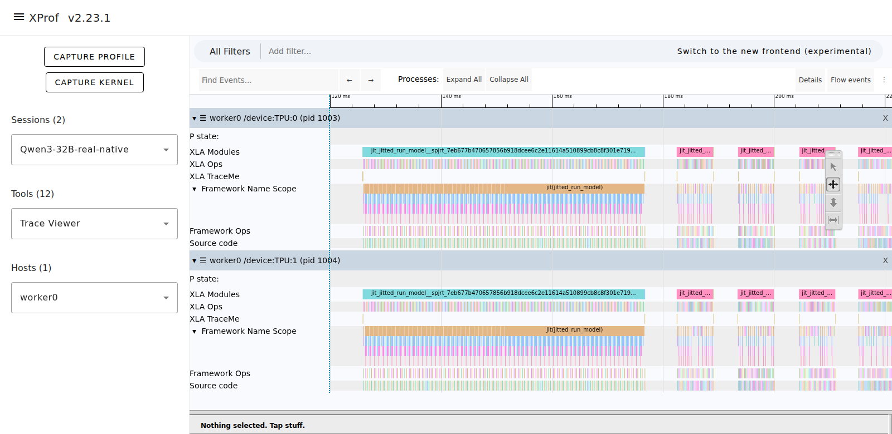
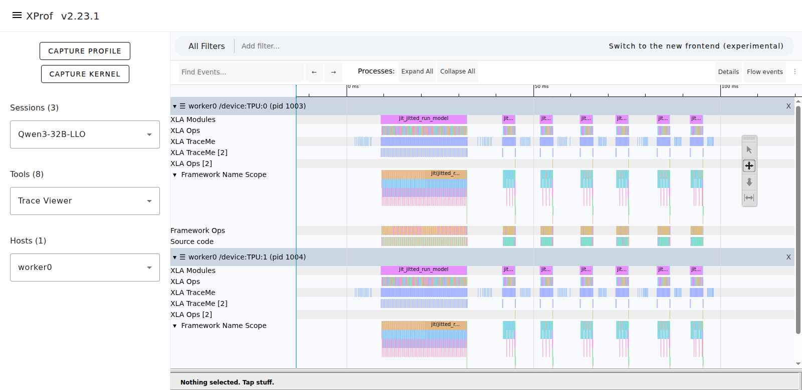
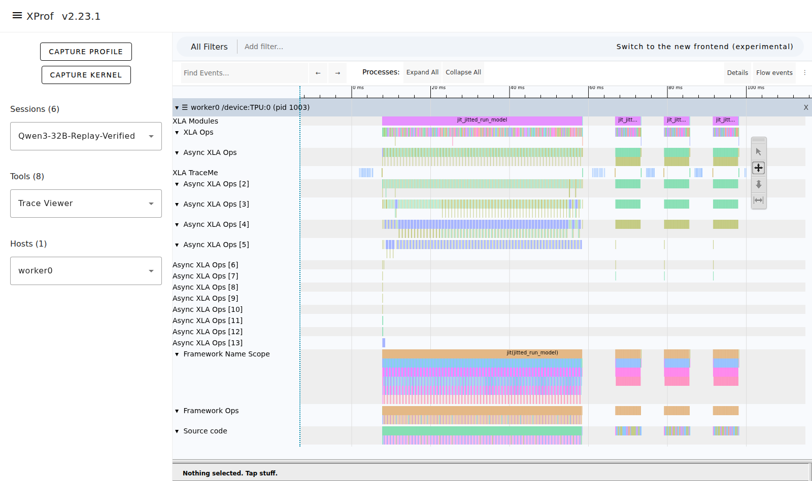

# Run workloads and inspect profiles

Install sim-pjrt in your workload's Python environment, then start with
`spjrt run workload.py`. See [installation](../README.md#installation).
The launcher sets up the simulated backend; manual PJRT environment variables
are unnecessary for normal use.

## SGLang-Jax

Install SGLang-Jax separately in the same environment; see the tested
[dependency versions](dependencies.md#python-runtime-baseline). Then run:

```sh
spjrt run python -m sgl_jax.launch_server \
  --model-path /path/to/model --tp-size 8 --load-format dummy
```

Replace `/path/to/model` with your model configuration/tokenizer directory.
`--tp-size` must fit the simulated device count. Dummy weights avoid loading
model weights; simulated outputs do not validate model quality.

## View a simulated XProf trace

Install `xprof==2.23.1`. In a single-process JAX workload, warm up the function
before tracing and wait for its results before ending the capture:

```python
with jax.profiler.trace("./profile"):
    result = compiled(*inputs)
    jax.block_until_ready(result)
```

Run the workload with `spjrt run`, then open the trace:

```sh
xprof server --logdir ./profile --port 8791
```

Open `http://localhost:8791` and select Trace Viewer.

| Track | What it shows |
| --- | --- |
| XLA Modules | Predicted duration of each compiled program |
| XLA Ops | Predicted operation intervals and missing-cost annotations |
| Host / PJRT | Time observed on the CPU running the simulator |

These views overlap; do not add their durations together. Host waits include
CPU scheduling and are not measured TPU delays. Add `--report ./run` to
`spjrt run` to save JSON reports for inspecting unresolved costs.

For SGLang capture, use its scheduler profiler; the configured
[integration runner](../tests/README.md#native-integration) supports
`SIM_PROFILE=1 bash tests/run_libtpu_tests.sh`. For real TPU measurements, use
[collection](collection.md).
For SGLang collection/replay, the compilation observer must also run in its
scheduler process; the CLI currently instruments its own Python process only.

## Qwen3-32B example

The captures below use the full 64-layer Qwen3-32B model with dummy BF16 weights,
TP=8 on a v7x-8 topology, native attention, and page size 16. Each request has
1,024 input tokens and 16 output tokens, with batch size 1; tracing starts after
two warmup requests. The screenshots focus on selected devices.

**Real TPU:** measured prefill and decode execution.



**LLO:** estimated module and operation intervals. Missing costs remain visible;
these estimates have not been calibrated to the real capture.



**Replay:** a complete measured invocation near the median, including per-device
XLA Ops, async operations, TraceMe, framework scopes, and source locations.
Host dispatch gaps come from the current CPU run. Unmeasured startup programs use
`--replay-miss llo`; the forward and sampler programs shown use measured timelines.



## Troubleshooting

| Problem | What to check |
| --- | --- |
| Plugin or libtpu not found | Run `spjrt doctor` in the same environment; source builds can pass `--plugin` |
| Workload module not found | Install its dependencies in the environment containing `spjrt` |
| Floating outputs are zero | These are expected placeholders; simulation checks execution and timing |
| First run is slow | Compilation is included in CPU wall time; inspect the predicted durations in the report |
| Virtual HBM OOM | Reduce logical allocations or set the target's `--hbm-capacity-gib` / `--hbm-reserved-gib` |
| Bundle timing has unresolved semantics | Inspect the cost gaps; strict profiles reject them, partial profiles only time covered work |
| Unknown loop bound or analysis limit | This path is currently unsupported even with partial timing; simplify the workload |

For implementation details, see [architecture](compilation-architecture.md)
and the [timing reference](bundle-timing.md).
