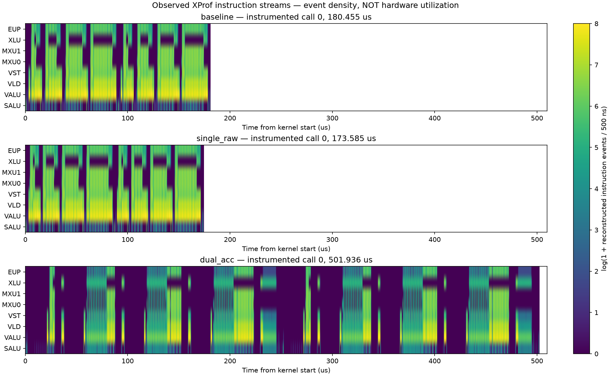

# TPU7x LLO 流水线模拟与实测校验

目标：使用 `~/lab/tpu-kernel-lab` 已采集的 profile，校验并完善 sim-pjrt 的流水线模型。
**目前尚未达到独立预测硬件完整流水线的验收标准。** 下文分别记录已实现能力、硬件证据与仍缺失的输入；复现 XProf 图形不等于预测硬件。

后续本地完善已提取并接入 libtpu 0.0.48 的 GF 编译器成本表（465 行、32 列资源），新增生产者 hold 与消费者 issue-check 分离。当前共 59 项 Python 检查和 3 个相关 Bazel 目标通过。详见 [GF 成本表与资源约束](gf-compiler-costs.md)。下文三份 profile 的硬件准确性结论保持不变。

## 固定输入与范围

2026-10-08 从 `evidence/dual-acc-overlap` 复制 baseline、single_raw、dual_acc。
实验 `exp-hma5k01rvt`，artifact `art-lh9kina7do`。这三份是检查时本地已完整下载、带原始 XPlane 的细粒度 capture；其他更新的实验目录不能仅凭元数据当作完整 capture。

- 2K causal MHA，32 heads，D256，BF16，Q512/KV256，TPU7x，一个 JAX device。
- 原始 XPlane、trace JSON、匹配源码及辅助分析保存在 `.build/pipeline-validation/inputs/`。
- [输入清单](../benchmarks/pipeline_validation/input_manifest.json) 记录原路径、复制路径、字节数、SHA256。19 个校验文件共 1,152,322,513 字节。
- [执行计划](../benchmarks/pipeline_validation/plan.json)；[分析脚本](../benchmarks/pipeline_validation/analyze.py)。没有改动相邻项目 kernel，也没有启动新 TPU 实验。

| 版本 | 源码 SHA256 前缀 | 插桩 call 0 / call 1（µs） | 同源码普通 benchmark（µs） |
|---|---|---:|---:|
| baseline | `e6cf6adfe481` | 180.455 / 180.196 | 174.735 |
| single_raw | `8c93c52c2dca` | 173.585 / 173.517 | 167.636 |
| dual_acc | `e456ce0f0514` | 501.936 / 501.308 | 276.257 |

普通 benchmark 来源是邻项目保存的 `exp-om5v6wosep` 结果；不用于拟合插桩二进制。源文件相同不能证明二进制、bundle 地址、CFG 相同。

## 测量层次

1. **硬件 trace 锚点 / 计数器**：用于校验时间、动态指令量和真实资源等待，但必须核对 device、capture 区间与计数器定义。
2. **XProf 重建的指令事件**：编译器提供指令成本，XProf 在硬件锚点之间插值。事件宽度不是该条指令独立测得的完整延迟；轨道空白不是精确硬件 idle。
3. **模型预测**：只消费已解析动态路径、依赖和目标参数，不消费待预测调用的实测时间戳。
4. **相同二进制重复调用对照**：call 0 对齐 call 1，仅用于检验稳定性、丢事件和对齐质量。即使误差极小，也不能称为独立模型的留出验证。

[XProf 官方说明](https://github.com/openxla/xprof/blob/master/docs/custom_call_profiling.md) 明确描述了稀疏插桩、周期成本换算与时间插值。插桩会改变代码，增加 trace 频率也可能导致 buffer 丢事件。不能用“没有 dropped 提示”证明指令序列完整。

当前导出的 MXU 事件例如 `vmatmul.mubr %61514`、`vpop`，缺少最终物理 MRB 地址和完整 modifier。DMA 也保留符号操作数，不能从显示宽度恢复传输字节数、目的地址、信号量与完成时刻。

## 已实现的模拟能力

新增 [pipeline.py](../python/sim_pjrt/llo/pipeline.py)，是显式启用的调度模块，尚未替换运行时默认估时器。

| 能力 | 实现与边界 |
|---|---|
| 发射与结果分离 | resource reservation 控制吞吐，operation latency 控制结果可用时间；不会把每次 matmul 都串行加 211/221 cycles |
| 多执行单元并发 | 不同资源可重叠，同一个 bundle 作为整体发射；不合法的同资源 co-issue 报错 |
| 多阶段资源占用 | 支持 offset + duration 预约，允许在未来预约前的空档执行其他工作；可以表示不同 MXU 子资源 |
| MRB 依赖 | Final LLO 适配器按物理槽位生成 producer / consumer 依赖；槽数、结果延迟、pop 成本必须显式传入 |
| MRB 生命周期 | 重用槽位依赖之前的 pop 完成；缺 producer、未消费覆盖、缺物理地址都留下 gap，不默认零等待 |
| 异步 DMA / 同步 | 通用调度器可以表示传输资源占用及完成依赖；从真实 LLO 自动解析所有 DMA 参数尚未实现 |
| 重叠等待 | 只推进到尚未满足的依赖/资源时间；已重叠的计算和传输不重复加总 |
| 完成尾部 | 最后一个 bundle 发射后，仍计入所有在途操作/预约的尾部 |
| 时间线导出 | Chrome trace 单独显示资源预约、结果延迟、bundle 等待，明确标注 `modeled` |
| 不完整模型 | 有任何 gap 则 `estimated_seconds=null`，只给出 `modeled_seconds`；不宣称目标硬件已校准 |

通用调度器的 JSON CLI：

```bash
PYTHONPATH=python .venv/bin/python -m sim_pjrt.llo.pipeline \
  benchmarks/pipeline_validation/example.json \
  --report /tmp/pipeline-report.json --trace /tmp/pipeline-trace.json
```

示例仅验证异步 DMA 与 MXU 结果依赖，不代表真实 attention kernel。MRB 适配器只计算显式动态路径的 MXU/MRB 部分，始终报告非 MXU、DMA、控制流与 IMEM 未覆盖；不能据此给出完整 kernel 性能承诺。

`read_xplane(..., include_instructions=True)` 新增可选指令轨道导入，保留 bundle / ordinal / details / unit_id 与原始 ps 字段，并标注 `xprof_reconstructed`。默认 HLO 导入行为不变；这项改动提供比对输入，不把重建轨道转换成硬件测量。

## 硬件证据与不能混算的部分

详细数据：[硬件计数器](../benchmarks/pipeline_validation/results/hardware-counters.json)。这些是 **capture 范围**，不是每次 kernel 的局部计数，等待原因可能同时成立，不能逐项相加当作总时间。

| DIE0 计数器（两个请求所在 capture） | baseline | single_raw | dual_acc |
|---|---:|---:|---:|
| 每个 MXU 的 BF16 matmul | 36,864 | 36,864 | 36,864 |
| IMEM 写入 Q128 单位 | 416 | 416 | 547,336 |
| IMEM 写入字节（×128） | 53,248 | 53,248 | 70,059,008 |
| MRB_RESULT_WAIT | 2,514 | 2,523 | 2,331 |
| MATMUL_PATH_RESERVED | 4,959 | 4,833 | 12,256 |
| XLU_PATH_RESERVED | 948 | 815 | 55,046 |
| TRF_RESULT_WAIT | 2,016 | 2,016 | 157,284 |
| BRANCH_SREG_RESERVED | 16 | 16 | 417,010 |

由此可以排除“只补 MXU matmul 数量/吞吐即可解释所有回退”的做法。dual_acc 的 MRB 等待没有跟总时延同比增加，而转置/XLU、分支和插桩 IMEM 等证据变化显著。它们提示应补哪些资源模型，**尚不足以把时间回退逐项归因**。

`COUNT_CYCLES` 约九亿，明显覆盖 host 间隔及较长采样窗口，不能作为约 180µs kernel 的 cycles。`COUNT_MXU_BUSY_0/1/2` 也不能只凭名字当作三个 MXU 或直接算 MFU，必须按计数器定义解读。

`COUNT_IMEM_STARVATION` 是 IMEM DMA 写入因冲突连续等待超过 16 cycles 的告警，不是取指饿死计数。其值为零不能证明无 IMEM 问题。

邻项目普通运行的后续计数器实验 `exp-0q7flnbwl7` 三版 IMEM 字节量相同。因此 70MB IMEM 写入和大间隙首先属于插桩二进制，不能迁移成普通 dual_acc 276µs 回退的完整解释。

## 责任与缺口

本任务是 Pallas kernel 与 TPU profile 验证，不涉及 SGLang-JAX 请求代码。不能把这些问题归到 sglang-jax。

| 项目 | 归属 | 所需修复/验证 |
|---|---|---|
| 只计算 bundle issue / 部分 DMA / matmul throughput | sim-pjrt 模型覆盖不足 | 新模块支持独立结果依赖，但仍需目标参数及集成 |
| 未保留 LLO 指令轨道和物理身份 | sim-pjrt 导入能力 | 已新增 opt-in 保留；原始 profile 缺失的信息无法凭空补回 |
| XProf 插值、省略物理操作数、lite proto 缺内部 loop | 观测格式限制 | 获取同一编译的后端 Final LLO、完整 CFG、硬件 trace 锚点 |
| 插桩扩大 IMEM / 改变调度 | 测量扰动 | 插桩、普通运行分别建模和验证 |
| capture 计数与 kernel 窗口不同 | 验证方法约束 | 绑定时间窗口后再计算利用率，保留计数器描述 |
| MRB / VMEM / VREG / XLU / TRF / EUP / DMA / IMEM 参数 | 目标硬件模型缺口 | 锁定 libtpu build，独立微基准或精确同版本逆向；不能用总耗时拟合替代 |
| 大 JSON / LLO 解析与别的编译抢资源 | 本地运行约束 | `lab capped`：128GiB 上限、96GiB high、swap 0、900s，共享锁，不绕过 |

## 外部资料与参数可信度

- [JAX TPU pipelining](https://docs.jax.dev/en/latest/pallas/tpu/pipelining.html)：用于核对计算与 DMA 重叠、缓冲生命周期；不提供本 kernel 的逐周期性能保证。
- [GF MXU 逆向记录](https://gh.evko.io/crucible-notes/libtpu/cost/mxu-latency-gf.html)：基于 **libtpu 0.0.40**，描述 11 个 MXU 资源及 211/204-cycle 基础延迟。其 dtype 标签与本仓库核过的枚举存在不一致，不能直接移植表头数字到 0.0.48。
- `221 cycles` 和 `2.2GHz` 是邻项目已有模型的假设，不是本次测出的常数。新模块不默认套用 221，示例数值不进入 TPU 默认配置。
- DMA fragment 的 HLO 效率系数不能直接当成每条 DMA 指令额外延迟。

## 验证与验收

已通过 12 项新增测试，覆盖吞吐/结果延迟分离、双 MXU、DMA 重叠、MRB 重用、多资源预约、未知输入、ps 导入及与穷举整数调度器对照。当前工作区原有 profile 导入 16 项、bundle timing 21 项回归通过，共 49 项；基于 PR1780 修复提交 `b09ac15` 的隔离工作树还通过其 23 项 bundle timing 测试（该树合计 51 项）。

两个新目标 `//tests/python:pipeline_test`、`//tests/python:pipeline_import_test` 已加入 Bazel 常规测试套件，均实际执行通过；后者显式声明 protobuf 运行时依赖。

三份原始 trace 已分别通过限额解析，约 50–56 秒/份，峰值内存 4.6–4.8GiB，swap 为零。
原始 XPlane 审计也完成：都有指令轨道，未发现 plane 级时钟频率字段；warnings/errors 为空，但这不能排除细粒度事件缺失。

| 版本 | trace 对硬件 matmul 计数差异，MXU0 / MXU1 | 相同二进制两次调用时长差异 | occurrence 对齐起始时间 P95 / 最大绝对差（µs） |
|---|---:|---:|---:|
| baseline | −1.364% / −0.884% | 0.144% | 0.269 / 134.348 |
| single_raw | −1.044% / −0.507% | 0.039% | 0.612 / 158.080 |
| dual_acc | −1.283% / −0.597% | 0.125% | 0.952 / 314.399 |

此处 occurrence 对齐使用 `(lane, bundle, ordinal, opcode, occurrence)`，共同事件比例为 99.1%–99.5%；**这仍不是可靠的完整动态路径对齐**：一旦某次循环缺事件，后续同地址 occurrence 可以错配。较小 P95 与非常大的最大误差并存，尤其 SALU 的 P95 达 18–65µs。后续应使用匹配 CFG 和硬件锚点约束迭代身份，不能删除离群值后宣称精确。

三版 call 0 检查到的约 28 万个 matmul/pop 事件，各自都没有 `mrb[...]` 物理地址。当前输入不足以把上述 MRB 调度器直接接到完整 profile 动态指令流上。

仅以 matmul 数量、8-cycle issue 和假设 2.2GHz 计算的资源下界，call 1 分别为 66.444、66.724、66.611µs，比实测低 63.13%、61.55%、86.71%。**这是用于暴露缺口的计数下界，不是新调度器或旧模拟器对完整 kernel 的预测误差。**

结果文件：[baseline](../benchmarks/pipeline_validation/results/baseline.json)、[single_raw](../benchmarks/pipeline_validation/results/single_raw.json)、[dual_acc](../benchmarks/pipeline_validation/results/dual_acc.json)、[XPlane 审计](../benchmarks/pipeline_validation/results/xplane-audit.json)。



横轴使用相同 µs 刻度，颜色是 500ns 内重建事件数量的对数，不能解释成硬件利用率。
[资源下界对照图](../benchmarks/pipeline_validation/results/resource-floor.svg)；[合成流水线示例](../benchmarks/pipeline_validation/results/example-pipeline.svg)；[示例 Chrome trace](../benchmarks/pipeline_validation/results/example-trace.json)。

原始 trace 校验命令（每次只运行一版）：

```bash
cd ~/lab/tpu-kernel-lab
./lab capped ~/lab/sim-pjrt/.venv/bin/python \
  ~/lab/sim-pjrt/benchmarks/pipeline_validation/analyze.py \
  ~/lab/sim-pjrt/.build/pipeline-validation/inputs baseline \
  ~/lab/sim-pjrt/benchmarks/pipeline_validation/results
# 分别将 baseline 换成 single_raw、dual_acc。
```

最终验收还需要：同编译身份的后端调度和动态路径；明确时钟/硬件锚点；独立的 MXU/MRB、VMEM bank/RAW、XLU/TRF/EUP、DMA descriptor/queue、IMEM 参数；保留未用于定参的 kernel 变体和调用，分别报告总时延、各阶段、逐单位 issue 与 DMA/wait 重叠误差。目前不把同二进制 replay 小误差、资源计数下界或合成测试通过当作通过验收。

## 远端补充取证状态

使用 [falcon-workflow 技能](/home/yanko/.codex/skills/falcon-workflow/SKILL.md) 查询现有实验并运行只读清单分析 `an-x80sp2sjl2`，已成功读取声明输出。
[文件清单](../benchmarks/pipeline_validation/compiler-inventory-result.json) 有 76 项，三版的 `post-finalize-llo` 各约 46MB；这个名字代表 Mosaic 阶段，尚未证明是后端寄存器分配及调度后的 Final LLO。

将完整 LLO 压缩到 Falcon 分析结果存储再下载的动作被自动审批拒绝：理由是可能包含专有源码/调度信息，且远端导出未获明确授权。未执行该导出，已询问用户；本地模拟器修改与 profile 分析继续进行。该限制来自自动审批，不是 falcon-workflow 技能要求用户确认。
